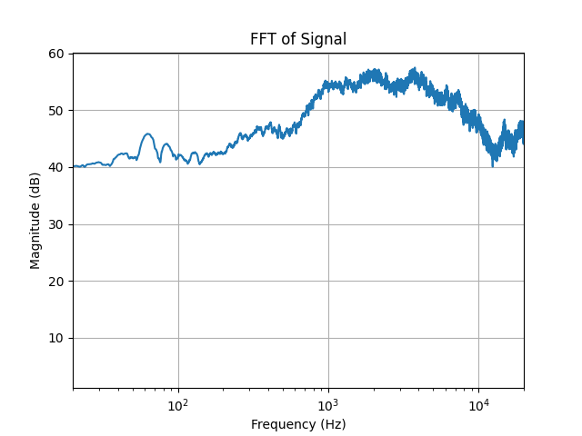
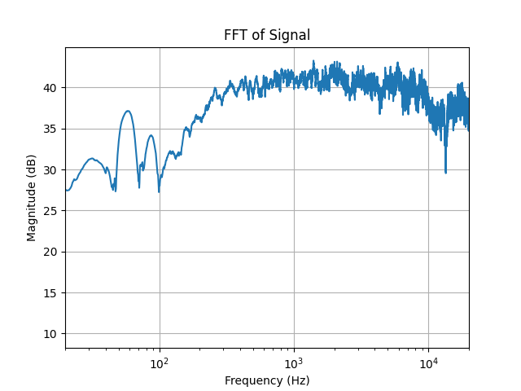
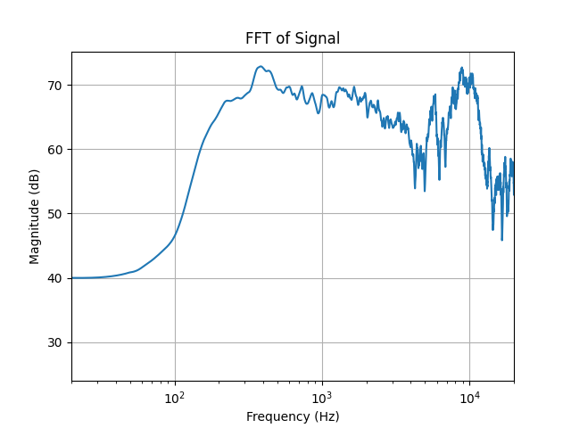
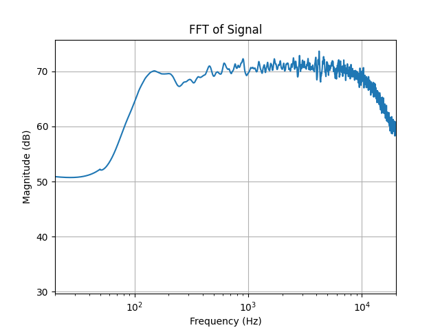
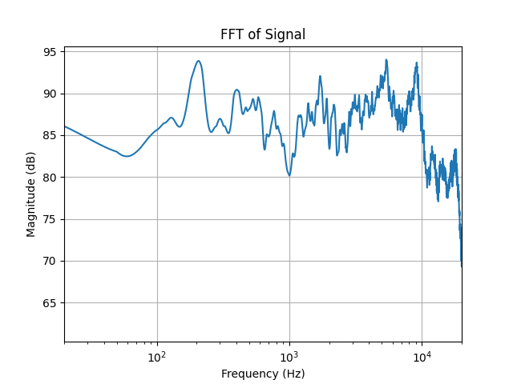
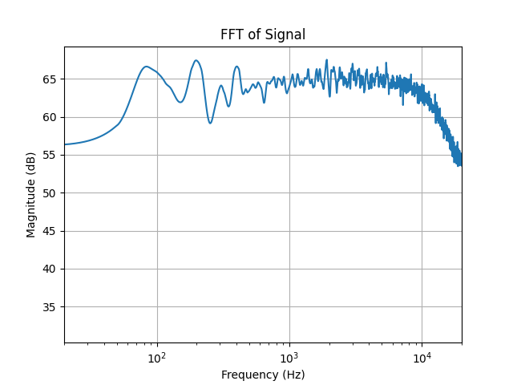
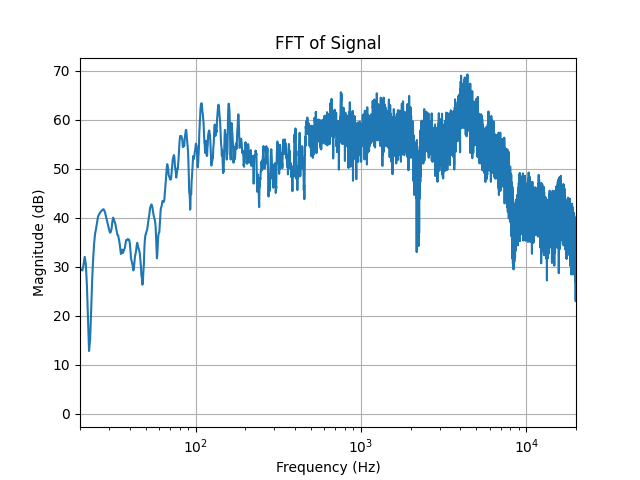
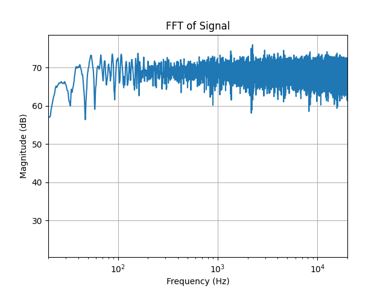

# Simple Equalizer

**A local web tool that measures your speaker's frequency response and tells you exactly how to set your PC's built-in equalizer.**

Plays a test signal, records the result through a microphone, averages multiple FFTs to reduce noise, and outputs per-band gain corrections you can dial directly into Windows' EQ. No DSP plugin, no driver hacks — just numbers for the sliders you already have.

<!-- TODO: hero screenshot or short gif of the web UI (homepage → running a measurement → result spectrum) -->

---

## Why

Most PCs and car stereos ship with a built-in graphic equalizer but no way to calibrate it — you move sliders by ear until it "sounds right," then a driver update wipes them. This tool replaces the guesswork with a 30-second measurement loop: play, record, FFT, read the gains off a chart.

The corrections stay with the OS-level EQ, so they survive driver resets that would wipe a VST or APO-based fix.

---

## Highlights

- **Multi-pass averaging** — 1 to 20 repeats per measurement, FFTs averaged in the frequency domain to cut room noise and mic jitter
- **Three measurement modes** — full-spectrum correction, limited-band (standard 9-band EQ points), and white-noise spectrum check
- **Per-band tuning instructions** — outputs dB adjustments keyed to 1 kHz reference, ready to transcribe into any graphic EQ
- **Persistent history** — every run is logged to SQLite (zero setup, single file), browsable at `/history`
- **Zero-build frontend** — Tailwind + Alpine.js via CDN, no `npm`, no bundler, no `node_modules`
- **Crash-safe IPC** — atomic writes to status/instruction files so the UI never reads a half-written line

---

## Results

Real measurements from a few setups I've calibrated. Left: uncorrected speaker response. Right: after applying the EQ suggestions this tool produced.

| Setup | Before | After |
| --- | --- | --- |
| MSI P65 laptop built-in |  |  |
| Xiaomi stereo |  |  |
| 3-inch bookshelf |  |  |
| 6.5-inch driver |  |  |

More measurements, including hand-built speaker cabinets and phone stereos, in [`result/`](result/).

---

## How it works

```text
┌─────────┐   play test tone   ┌──────────┐
│ Browser │ ──────────────────►│ Speaker  │
│   UI    │                    └─────┬────┘
└────┬────┘                          │ sound
     │ poll /status, /img            ▼
     │                         ┌──────────┐
     │                         │   Mic    │
     │                         └─────┬────┘
     │                               │ PCM
     │                               ▼
     │                    ┌────────────────────┐
     │                    │ FFT × N, averaged  │
     │                    │ smooth, normalize  │
     │                    │ invert → gain dB   │
     │                    └─────────┬──────────┘
     │                              │
     ◄──── PNG spectrum + per-band instructions
```

1. Flask spawns a measurement process (`multiprocessing`) so the UI stays responsive
2. `pygame.mixer` plays the test signal while `PyAudio` captures at 384 kHz
3. SciPy computes FFT; N repeats are averaged in the frequency domain before rendering
4. `TuningInstructor` reads per-band magnitudes, computes dB offsets from the 1 kHz reference, and writes the instruction text
5. All runtime state goes through atomic file writes; the frontend polls `run_id` to discard stale data from prior runs

---

## Getting started

```bash
git clone https://github.com/ricky5932TW/SimpleEqualizer
cd SimpleEqualizer
pip install -r requirements.txt
python web_gui.py
```

The app opens `http://127.0.0.1:5000/` automatically. Measurement history lands at `data/simpleequalizer.sqlite3` — set `SQLITE_PATH` to override the location.

<!-- TODO: short gif of a full measurement run, from form submit to result -->

---

## Configuration

The local defaults are tuned for running `python web_gui.py` from your desktop. Containers should override these environment variables:

| Variable | Default | Use |
| --- | --- | --- |
| `HOST` | `127.0.0.1` | Flask bind address. Use `0.0.0.0` in containers. |
| `PORT` | `5000` | Flask port. |
| `FLASK_DEBUG` | `1` | Set `0` in Docker. |
| `OPEN_BROWSER` | `1` | Set `0` in Docker so the container does not try to open a browser. |
| `SQLITE_PATH` | `data/simpleequalizer.sqlite3` | SQLite history location. |

---

## Docker

Build and run the web app:

```bash
docker build -t simpleequalizer:local .
docker run --rm -p 5000:5000 \
  -e HOST=0.0.0.0 \
  -e OPEN_BROWSER=0 \
  -e FLASK_DEBUG=0 \
  -v simpleequalizer-data:/app/data \
  simpleequalizer:local
```

Open `http://localhost:5000/`. This smoke-run verifies the Flask UI, status endpoint, and SQLite history path.

Docker Compose does the same thing with a named data volume:

```bash
docker compose up --build
```

Stop it with `Ctrl+C`, then clean up the container with:

```bash
docker compose down
```

### Audio in Docker/WSL

Simple Equalizer measures by playing audio with `pygame` and recording with `PyAudio`. Docker Desktop and WSL do not always expose Windows speaker/microphone devices to Linux containers, so measurement inside Docker is best effort.

For WSLg audio, run Compose from a WSL terminal, not from PowerShell. The override mounts the WSLg PulseAudio socket and routes ALSA/SDL audio through it:

```bash
cd /mnt/d/SimpleEqualizer
docker compose -f compose.yaml -f compose.wsl-audio.yaml up --build
```

Then open `http://localhost:5000/` from Windows. This requires WSLg to expose `/mnt/wslg/PulseServer` and Windows microphone permission to allow input from WSL.

On Linux hosts where ALSA devices exist, try:

```bash
docker run --rm -it -p 5000:5000 \
  --device /dev/snd \
  --group-add audio \
  -e HOST=0.0.0.0 \
  -e OPEN_BROWSER=0 \
  -e FLASK_DEBUG=0 \
  -v simpleequalizer-data:/app/data \
  simpleequalizer:local
```

If `PyAudio` cannot find an input device in Docker/WSL, run the measurement with native Python on Windows and use Docker for web smoke-tests or packaging.

---

## GitHub release and GHCR image

When a GitHub Release is published, the container workflow:

- publishes the Docker image to GitHub Container Registry (Packages)
- uploads the repository `Dockerfile` as a Release asset

Recommended release flow with GitHub Desktop:

1. Review the changed files in GitHub Desktop.
2. Commit the Docker and release documentation changes.
3. Push `main` to GitHub.
4. On GitHub, open **Releases** -> **Draft a new release**.
5. Create tag `v0.1.2-alpha` from `main`.
6. Use release title `v0.1.2-alpha`.
7. Mark it as a prerelease.
8. Publish the release.
9. Wait for the **Publish Container** GitHub Actions workflow to finish.

The prerelease image will be:

```bash
docker pull ghcr.io/ricky5932tw/simpleequalizer:v0.1.2-alpha
```

Prereleases do not publish `latest`; full releases will also publish `ghcr.io/ricky5932tw/simpleequalizer:latest`.

---

## Architecture

```text
Browser ──► Flask (web_gui.py)
              └─► MeasurementService (measurement.py)
                    ├─► SimpleEqualizer  (scripts.py)
                    │     ├─► SoundAnalyzer       play · record · FFT · export
                    │     └─► TuningInstructor    per-band dB suggestions
                    └─► History          SQLite run log (optional)
```

PlantUML sources in [`uml/`](uml/) — paste into [plantuml.com/plantuml](https://www.plantuml.com/plantuml/) to render:

- [class_diagram.uml](uml/class_diagram.uml) — module relationships
- [sequence_diagram.uml](uml/sequence_diagram.uml) — measurement flow with IPC timing
- [interaction_diagram.uml](uml/interaction_diagram.uml) — layered view (Browser ↔ Flask ↔ Service ↔ Core)

---

## Tech stack

| Layer | Choice | Why |
| --- | --- | --- |
| Web | Flask + Jinja2 | Server-rendered, no API split needed for a single-user local tool |
| Frontend | Alpine.js + Tailwind (CDN) | Reactive polling and clean styling without a build step |
| Audio I/O | PyAudio (capture) · Pygame (playback) | Low-latency capture at 384 kHz; reliable WAV playback |
| DSP | NumPy + SciPy | FFT, Savitzky–Golay smoothing, digital filters |
| Plotting | Matplotlib | Frequency-response PNGs served to the browser |
| Storage | SQLite (stdlib) | Single-file history log, zero infrastructure |
| Concurrency | `multiprocessing` | Measurement runs off the request thread |

---

## Project layout

```text
SimpleEqualizer/
├── web_gui.py           Flask routes
├── measurement.py       MeasurementService — bridges web to core logic
├── scripts.py           SimpleEqualizer facade — orchestrates measurement workflows
├── runtime_state.py     Atomic writes for status/instruction/run_id
├── schema.sql           SQLite schema for measurement history
├── package/
│   ├── soundAnalyze/        record · FFT · CSV export
│   ├── tuningInstructor/    per-band gain instructions
│   ├── soundSynthesis/      shaped-noise WAV generator
│   ├── sweepGenerator/      log-sweep chirp generator
│   └── history/             SQLite run log
├── templates/           Jinja2 templates (extend base.html)
├── static/              Tailwind/Alpine frontend, script.js polling
├── soundFile/           Test signals (noise, white noise, sweep)
├── data/                Measurement outputs (CSV, SQLite)
└── result/              Archived before/after measurements — see Results above
```

---

## License

MIT — see [LICENSE](LICENSE).
